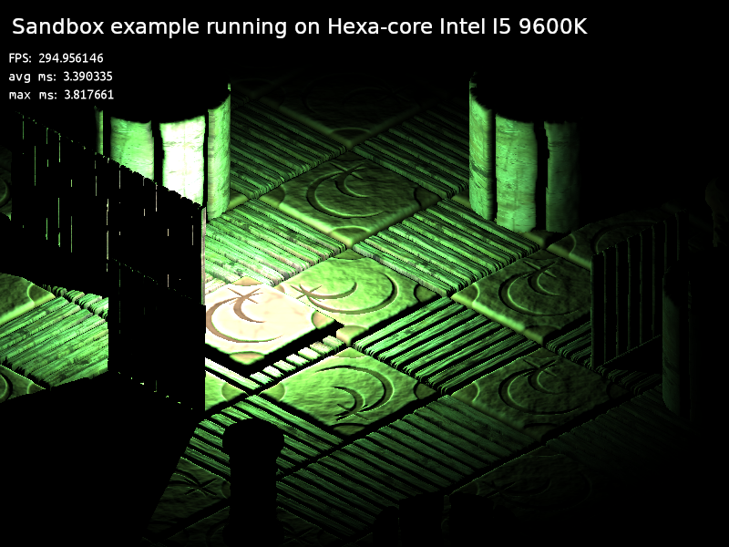

# DFPSR
A modern software rendering library for C++14 using SSE/NEON created by David Forsgren Piuva. If you're looking for the latest mainstream fad, look elsewhere. This is a library for quality software meant to be developed over multiple decades and survive your grandchildren with minimal maintenance.

## What your games might look like using isometric CPU rendering

Real-time dynamic light with depth-based casted shadows and normal mapping at 295 frames per second in 800x600 pixels running on the CPU. Higher resolutions would break the retro style and actually look worse, but there's lots of time left for game logic and additional effects. By pre-rendering 3D models to diffuse, normal and height images, reading the data is much more cache efficient on modern CPUs than using a free perspective. This also allow having more triangles than pixels on the screen and doing passive updates of static geometry. Low-detailed 3D models are used to cast dynamic shadows.

## Why use a software renderer when GPUs are so fast?
* **Minimal dependency** for minimal support cost. No customer will ever tell you that some shader wouldn't compile on a GPU driver you never even heard of. It's all pure math on the CPU sending calls directly to the system.
* **Robust** because it will probably not ruin your system when making a mistake, unlike graphics APIs for the GPU that are prone to blue-screens. There are layers of safety for most API calls and pointer classes have extra tight memory protection in debug mode while leaving no trace in release mode.
* **Determinism down to machine precision** means that if it worked on one computer, it will probably work the same on another computer.
* **Often faster than the monitor's refresh rate** for isometric graphics with dynamic light. Try the Sandbox SDK example compiled in release mode on Ubuntu or Manjaro to check if it's smooth on your CPU. Quad-core Intel Core I5 should be fast enough in resonable resolutions, hexa-core I5 will have plenty of performance and octa-core I7 is butter smooth even in high resolutions.
* **Low latency for retro 2D graphics** using the CPU's higher frequency for low resolutions. There are no hardware limits other than CPU cycles and memory. Render to textures, apply deferred light filters or write your modified rendering pipeline for custom geometry formats.
* **Create your legacy.** Make software that future generations might be able to port, compile and run natively without the need for emulators.

## More than a graphics API, less than a graphics engine
It is a rendering API, image processing framework and graphical user interface system in a static C++14 library meant to minimize the use of dynamic dependencies in long-term projects while still offering the power to make your own abstractions on top of low-level rendering operations. The core library itself is mostly pure math and can be compiled on most systems using GNU's C++14, but the window backends that takes user input and displays the final image buffer are implemented outside of the library for each platform. This places most platform dependent code into a single module that can be ported relatively easy if you have worked with the system's native API before. A window backend for X11 is currently supporting Linux, which is recommended for trying the SDK and learning. A partial port without full-screen exists for MS-Windows. On embedded systems, you can output images as ascii art via SSH to debug robotic vision.

## Still a public beta
Don't use it for safety-critical projects unless you verify correctness yourself and take all responsibility. Either way, it's probably a lot safer than using OpenGL, OpenCL or Direct3D simply by being a single implementation where bugs will be mostly the same on each platform. Stack memory for VLA may vary. Test everything with billions of cases.

## Platforms
* Developed mainly with Ubuntu on desktops and laptops.
* Tested with Manjaro, my new favorite Linux distribution. Installing GPU drivers and running the latest AAA games was much easier than on other distributions. I would still use CPU rendering for most of my development where GPU rendering would simply be total overkill and only increase future maintenance costs.
* Tested with Ubuntu mate on Raspberry Pi 3B and Pine64. (Ubuntu Mate didn't work on Raspberry Pi Zero)
* Tested with Raspbian Buster on Raspberry Pi Zero W (X11 doesn't work on older versions of Raspbian)
* Linux Mint need the compiler and X11 headers, so run "sudo apt install g++" and "sudo apt install libx11-dev" before compiling.
* Runs slowly on Windows 7 without full-screen.

## Supported CPU hardware
* Intel/AMD using SSE2 intrinsics.
* ARM using NEON intrinsics.
* Unknown Little-Endian systems. (without SIMD vectorization)

## Will not target:
* Mobile phones. Because the constant changes breaking backwards compatibility on mobile platforms would defeat the purpose of using a long-lifetime framework, you will be on your own if you try to use the library for such use cases. You cannot just take something from a desktop and run it on a phone, because mobile platforms require custom C++ compilers, screen rotation, battery saving, knowing when to display the virtual keyboard, security permissions, forced full-screen... Trying to do both at the same time would end up with design compromises in both ends like Microsoft Windows 8 or Ubuntu's Unity lock screen.
* Web frontends. Such a wrapper over this library would not be able to get the power of SIMD intrinsics for defining your own image filters, so you would be better off targeting a GPU shading language from the browser which is more suited for dynamic scripting.
