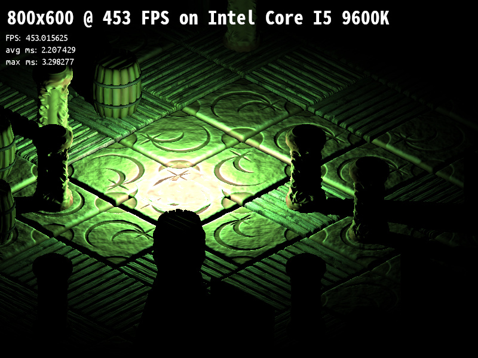
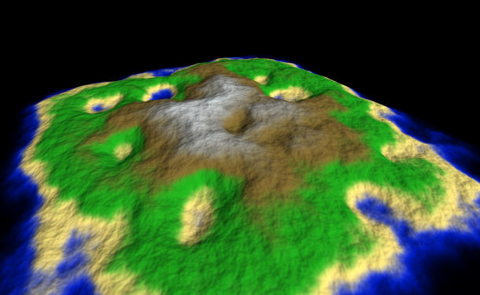

# DFPSR
A modern software rendering library for C++14 using SSE/NEON created by David Forsgren Piuva. If you're looking for the latest mainstream fad, look elsewhere. This is a library for quality software meant to be developed over multiple decades and survive your grandchildren with minimal maintenance. Just like carving your legacy into stone, it takes more effort to master the skill but gives a more robust result by not relying on a far away library. Maximum user experience and minimum system dependency.

## Creator's background
DXOMARK world record in digital video stabilization from the mobile industry. Worked with safety critical robotic vision for civilian airport traffic control. Held lectures in optimization at different companies in the mobile, medical and gaming industries. Worked with optimizations on GPU, CPU, DSP, ISP, FPGA and ASIC.

## Optimization needs good tools to save your time
The most important part about optimizing code is to grasp both high algorithms and low hardware limitations, because you can not let a scientist design the algorithm and a programmer optimize it with no room for changes in handwritten assembler (the most common mistake). The algorithm design is not done until you have a good tradeoff between quality and performance with all optimizations in place. Time savings at the cost of quality in one place can be compensated by increasing quality at a lower cost somewhere else to increase both speed and quality. The faster you can create a near optimal vectorization of an algorithm, the faster you can iterate the design process. Think about what you are truly approximating. Is your goal to draw as many perfectly straight polygons as possible, or is the goal to approximate a complex real world shape using any technique?

The official website:
[dawoodoz.com](https://dawoodoz.com)

## What your games might look like using isometric CPU rendering

Real-time dynamic light with depth-based casted shadows and normal mapping at 453 frames per second in 800x600 pixels running on the CPU. Higher resolutions would break the retro style and actually look worse, but there's lots of time left for game logic and additional effects. By pre-rendering 3D models to diffuse, normal and height images, reading the data is much more cache efficient on modern CPUs than using a free perspective. This also allow having more triangles than pixels on the screen and doing passive updates of static geometry. Low-detailed 3D models are used to cast dynamic shadows.

## Traditional 3D rendering with polygons is also supported

3D rendering is not as fast as 2D or isometric rendering on the CPU, but often reaches 60 Hz in 1920x1080 pixels for low-detailed graphics. For higher detail level and more features, it is recommended to copy and modify the rendering pipeline to make it hardcoded for only the features you want and then simplify the math for your specific rendering engine, as done for the Sandbox example where only vertex colors are needed for tiny triangles without perspective, so that colors can be calculated by incrementing color values instead of interpolating from depth divided coordinates.

## Why use an open-source software renderer when GPUs are so fast?
* **Robustness** Using a software renderer will probably not ruin your system when making a mistake, unlike graphics APIs for the GPU that are prone to blue-screens.
* **Determinism** If it worked on one computer, it will probably work the same on another computer with minor differences between operating systems. OpenGL however, has zero features remaining if you remove everything that has a bug in any driver implementation.
* **Low overhead** When you want a low resolution for the visual style or robotic vision, you might as well keep it minimal with a statically linked software renderer when the GPU would be slower.
* **Easy debugging** When all the data is processed in a software renderer, it is much easier to see what went wrong during debugging.
* **Easy to modify** There are no hardware limits other than CPU cycles and memory, so you can modify the whole rendering pipeline by copying and pasting code.
* **Pixel exact 2D** Instead of making strange workarounds over polygons, a software renderer let you work with whole pixels to begin with.

## Why use this software renderer?
* **Minimal system dependencies** Everything related to a specific system API is placed in a separate wrapper module integrating the bare minimum of essential features that should be easy to integrate on future operating systems. Unlike other software renderers, this one does not require any graphics drivers, because you can get the same performance using multi-threading by uploading the canvas on a background thread when most cores are idle anyway.
* **No binaries** The whole library is automatically compiled from source code. Even the build system is compiling itself before building your project. This makes sure that nobody in the future has to reverse engineer century old binaries when trying to build your program, and it also makes it a lot safer against malware when everything can be inspected in readable code.
* **Static linking** The whole library is linked statically with your program, just as if you had written the code yourself. Only core system APIs that have survived for decades are relied on as dependencies, no GPU drivers, no external media layers. Everything from how to encode Unicode characters and render fonts to how a polygon is rasterized against a depth buffer will exist within your compiled C++ program for maximum reliability and determinism. The build system allows statically linking the C++ standard libraries when possible.
* **Create your legacy** Make software that future generations might be able to port, compile and run natively without the need for emulators or reverse engineering of proprietary graphics drivers.

## Features in this library
* **Fully automatic C++ build system** No more long lists of source files in your project. The included build system will find included headers and their by name corresponding source files automatically. Just tell it to crawl from main and let it figure out the rest automatically. Different backends for libraries are handled by including the library's project header, telling which backend to use for each platform. Checksums are used to only build what has changed, so there is no need to create a static library for parts of your code.
* **2D drawing** Pixel exact standard draw calls for lines, rectangles, solid image copy, alpha filtered image drawing, depth buffered drawing, and stencil drawing.
* **3D rendering** Roughly equivalent to Direct3D 7 with bi-linear texture sampling, mipmapping, lightmaps and alpha filtering when used out of the box, but can be modified to be more like Direct 3D 9 if you apply shading to textures (can use SIMD with multi-threading and be scheduled based on viewing distance).
* **Occlusion system** The collection of rendering tasks for multi-threading also contains an occlusion grid where occlusion shapes can be drawn to skip drawing of triangles, object or whole groups if your engine implements a broad-phase for culling and occlusion tests. This fully dynamic occlusion can then be combined with static optimizations for specific games using information about which regions can be seen from each camera location.
* **Optional far clipping** Because this graphics API only uses floating-point depth buffers for perspective, there is no need to normalize the depth values for any integer based representation. This allows selecting an infinite far clip distance when creating your camera, if you can afford rendering the entire scene at once.
* **Media layer** Cross-platform media layer designed for robustness. Alsa and WinMM sound backends for full control over sound mixing, without having to call anything system specific yourself. Window management uses multi-threading for uploading the canvas, so that you don't need a GPU graphics drivers and heavy dependencies just to upload the result. Uses a borderless window for full-screen, so that you can easily access other programs if you get an important e-mail or instant message in the background. Upscaling is done on the CPU to work with any screen resolution without relying on graphics drivers that might give pixels the wrong interpolation or not even exist. Older media layers designed for CTR displays may cause frequency out of range errors when no graphics drivers are installed and the display does not accept the arbitrary selection of resolution. Uses an invisible cursor icon to hide the mouse, so that a crashing program will not take away the cursor when trying to kill the process.
* **Graphical user interface framework** Load a visual interface to your window using a single line of code reading a layout file or string. Get generic handles to components using names or a combination of name and index. Add events by attaching lambda functions to component and window callbacks.
* **Timers** Get the double precision seconds passed since the first call to the timer, so that you won't have to worry about midnight bugs when the time of day resets.
* **SIMD abstraction layer** Use simd.h to automatically generate highly efficient SSE, AVX and NEON intrinsics from fully readable math syntax. Your vectorized code will look like a reference implementation and compiling for an unknown target architecture will generate scalar operations that can still give a performance boost by writing your algorithm with basic operations that are most often supported directly in CPU hardware, accessing memory aligned with cache lines, keeping the instruction window packed with tasks, and making it very easy for a compiler's auto-vectorization if something similar with a different name exists in the future.
* **Safe pointers** Use SafePointer.h to catch more errors by telling your pointer which part of an allocation it may work on. Leaves no overhead in the release version, so that you can always replace your raw pointer with SafePointer and know that you will get an informative error message with the pointer's name and detailed information when something bad happens.
* **Strings** Use UTF-32 to store characters in memory to make sure that all algorithms work with non-latin characters (compatible with U"" string literals). Saving to files default to UTF-8 (compact storage) with BOM (explicitly saying which format is used) and CR LF line endings (so that text files encoded anywhere can be read everywhere). Uses shared memory buffers automatically to allow splitting into a list of strings without flooding the heap with small allocations.
* **Buffers** All files are saved and loaded through Buffer objects. This makes sure that all file formats you design only have to worry about how to encode the bytes, regression tests will be easy by not involving external side-effects from the file system, and any file can be bundled into your own by using the Buffer equivalent of a save function.
* **File management** Roughly equivalent to std::filesystem from C++17, but works with C++14, uses the same String and ReadableString types on all platforms, and can automatically correct folder separators between / (Posix) and \ (MS-Windows).
* **Process management** Can start other applications and keep track of their status, so that you can call an application like a function writing the result to files.

## Summary of licenses
This library mainly uses the Zlib Open Source License, but also includes the STB Image library for saving and loading images, which has a permissive dual license (MIT / Unlicense).
Because the STB Image library can be used as public domain, it does not have any legal effect on using the library as a whole under the Zlib Open Source License.
All included source code with all their licenses allow both commercial and non-commercial use, including undisclosed modification of the source code.
If you are not redistributing the source code, then you do not have to tell anyone that you use this library, because an insincere endorsement has no value.

## Still a public beta
Theme, GUI, font and sound APIs are still under active development and may have significant changes before a stable version 1.0 is ready, because some code is just a primitive placeholder until the advanced implementation can replace it, and one must try to actually use the library before usability problems become obvious. Buffer, file, image, draw, filter, string and time APIs are however already quite version stable. You can choose to stick with a specific version for each new project, keep updated with the latest changes, or wait for stable version 1.0.

## How you can help
* Port to Macintosh or Wayland using the same principles of minimal dependency.
* Test this beta version and give feedback on the design before version 1.0 is released.
* Create different types of game engines with open-source tools.

## Supported CPU hardware:
* **Intel/AMD** using **SSE2** intrinsics and optional extensions.
* **ARM** using **NEON** intrinsics.
* Unknown CPU architectures, without SIMD vectorization as a fallback solution.

## Platforms:
* **Linux**, tested on Mint, Mate, Manjaro, Ubuntu, RaspberryPi OS, Raspbian (Buster or later).
Linux Mint needs the compiler and X11 headers, so run "sudo apt install g++" and "sudo apt install libx11-dev" before compiling.
Currently supporting X11 and Wayland is planned for future versions.
* **Microsoft Windows**, but slower than on Linux because Windows has lots of background processes and slower threading and memory management.

## Partial support for
* MacOS can pass the regression tests, but has no native integration for sound or creating a window yet. MacOS does not have a symbolic link to the binary of the running process, so it would fall back on the current directory when asking for the application folder.

## Might also work on:
* BSD and Solaris have code targeting the platforms in fileAPI.cpp for getting the application folder, but there are likely some applications missing for running the build script.
Future Posix compliant systems should only have a few quirks to sort out if it has an X11 server.
* Big-Endian is supported in theory if enabling the DSR_BIG_ENDIAN macro globally, but this has never actually been tested due to difficulties with targeting such an old system with modern compilers.
